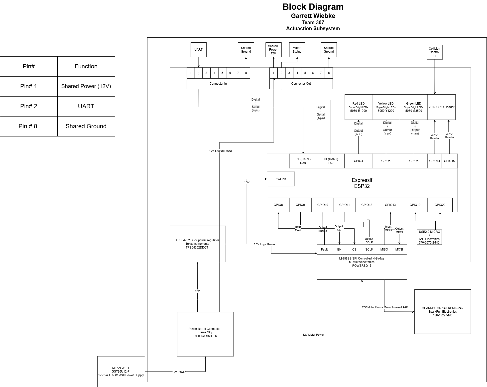

## Overview
This is the Actuation block diagram for Team 307 made by Garrett Wiebke.
The features include:

* SMT ESP32 controlling subsystem
* Motor driver using SPI communication between it and the ESP32
* 12V external power Supply, 3.3V 1.5A switching regulator 
* 12V High-Power DC Propulsion Motor 
* 12V 5A AC-DC wall power supply
* Communication via other modules via UART 
* Display OLED 
* Indicator LEDS
* Robust upstream/downstream 8-pin headers with shared power and ground

## Actuation Block Diagram 

