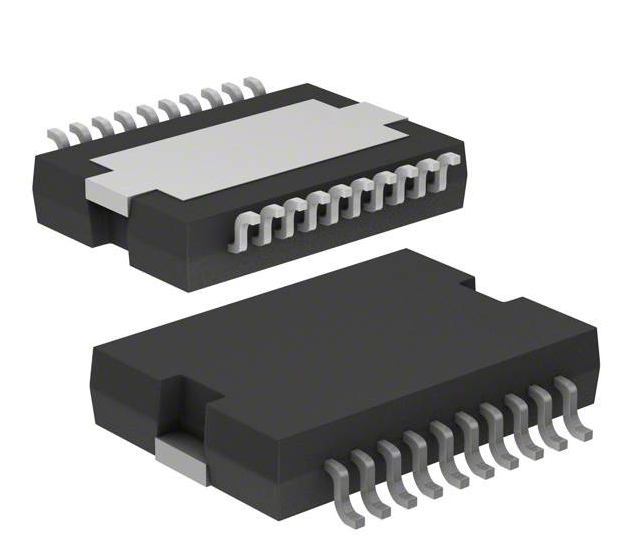
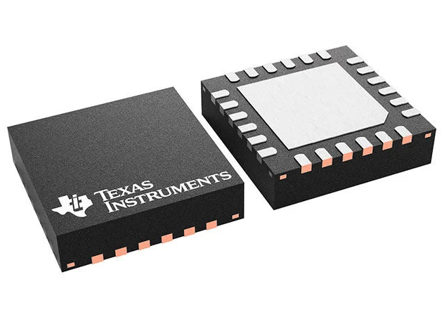
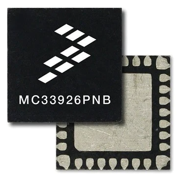
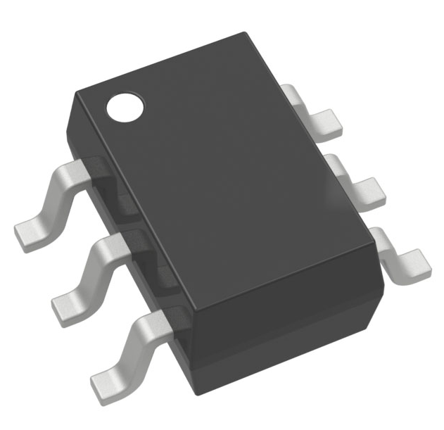
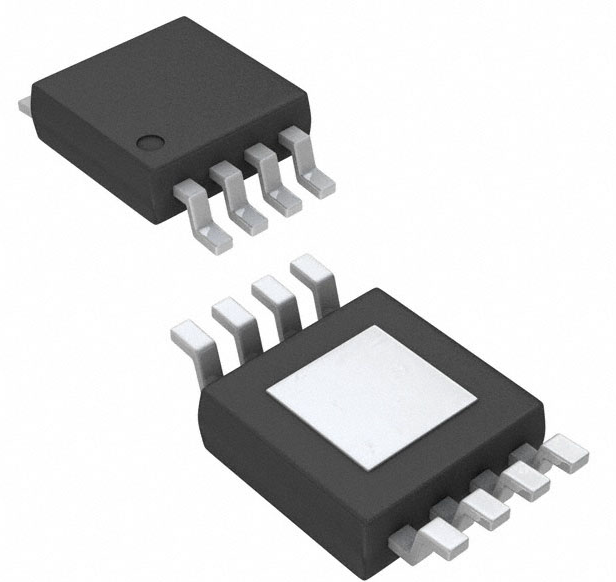
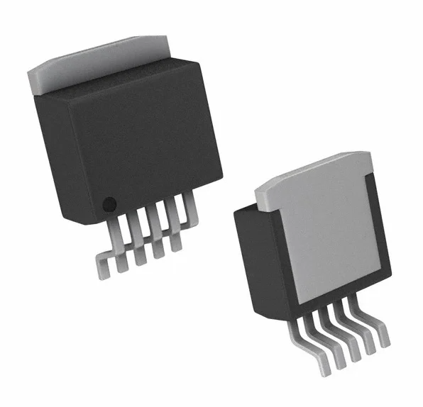
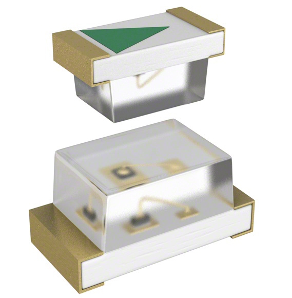
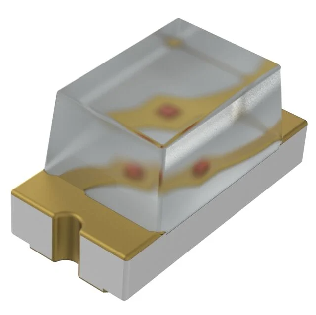
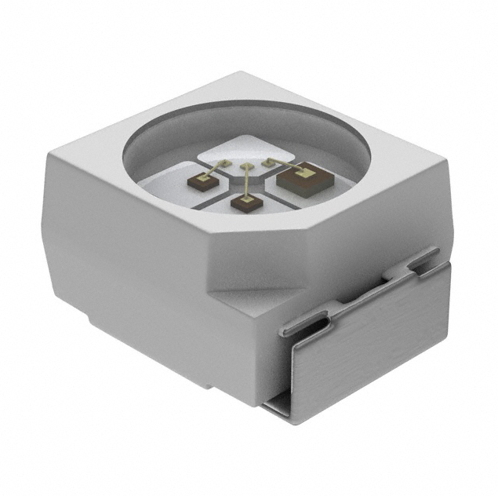

## Module's Selected Major Components

The following sections are the selected major components necessary for the actuation module of Team 307's submersible exploration device. Please note that the first two sections are hypothetical if the team went with brushless DC motor selection for propulsion, but, due to budget constraints, the team will go with a regular DC motor for proof of concept of the embedded system's functionality. 

The component selection showcases the type of microcontroller used for the module, a DC motor for propulsion, a servo motor for steering and depth control, a power regulator for motor power supply and logic voltage, as well as indicator LEDS for when the motor is stopped, 50% speed, or at full speed. All components were selected to meet project constraints and to be surface mount. 

# 3-Axis Motion Motors

## Brushless DC Motor + Propeller for Propulsion

---

*Table 1: BLDC Motor Option 1*

**EMAX Pro Series 2814 730KV Brushless Motor**

| **Component** | **Pros** | **Cons** |
|---|---|---|
|  EMAX Pro Series 2814 730KV Brushless Motor $31.99 each [link to product](http://readymaderc.com) | * Higher thrust capabilities * Efficient for longer run times * Reliable drone-specific BLDC motor * Powerful | * Higher power requirements than desired * Expensive including required components |

**Specifications**

- Model: EMAX Pro Series 2814 730KV Brushless Motor  
- KV: 730KV  
- Recommended Propeller: 8-10 inch  
- Max Thrust: Up to 2.3 kg (depending on prop configuration)  
- Motor Type: Brushless  
- Voltage: 6S LiPo (22.2V)  
- Weight: 155 g  
- Shaft Diameter: 5 mm  

---

*Table 2: BLDC Motor Option 2*

**DD2216 12V 500KV Waterproof ROV Brushless Motor**

| **Component** | **Pros** | **Cons** |
|---|---|---|
|  DD2216 12V 500KV Waterproof ROV Motor $30.00 each [link to product](http://hobbywater.com) | * Water-specific BLDC motor * Working voltage in the desired range * Low-profile package | * Cannot be tested in air * Cooling limitations for extended operation * Limited space for large propeller |

**Specifications**

- Motor KV: 500  
- Power: 87 W  
- Load Current: 7.3 A  
- Working Voltage: 12-16 V  
- Thrust: 1.2 kg (at 12 V)  
- Maximum Speed: 6100 RPM  
- Dimensions: Diameter 28 mm, Height 38.5 mm  
- Waterproof Depth: Up to 300 m  

---

*Table 3: BLDC Motor Option 3*

**RC Boat Brushless Motor 12-24V 300KV Underwater Thruster**

| **Component** | **Pros** | **Cons** |
|---|---|---|
|  RC Boat Brushless Motor 300KV [link to product](http://fruugo.us) | * Water-specific design * Good depth rating * Small profile * Operates within desired voltage range * Built-in propeller | * Least powerful BLDC option * Requires additional waterproof sealing * Lower durability materials |

**Key Specifications**

- Voltage: 12-24 V  
- Current: 20 A  
- KV: 300 KV  
- Materials: Stainless steel bearings, aluminum alloy shell  
- Propeller compatibility: Designed for PLA and PC propellers  
- Rotation options: Clockwise and counterclockwise available  

---

*Table 4: BLDC Motor Option 4*

**Underwater Brushless Motor 300KV for RC Boat Thruster**

| **Component** | **Pros** | **Cons** |
|---|---|---|
|  Underwater Brushless Motor 300KV $35.95 each [link to product](http://fruugo.us) | * Water-specific motor * Propeller included | * Low durability materials |

**Specifications**

- Motor KV: 300  
- Working Voltage: 12-24 V  

---

*Table 5: BLDC Motor Option 5*

**SunnySky X2826 Brushless Motor**

| **Component** | **Pros** | **Cons** |
|---|---|---|
|  SunnySky X2826 Brushless Motor $39.99 each [link to product](http://fruugo.us) | * Good power range * Reliable supplier * Good datasheet documentation | * Not water-specific |

**Specifications**

- Available KV Ratings: 550 KV or 800 KV  

---

*Table 6: BLDC Motor Option 6*

**SunnySky X2820 Brushless Motor**

| **Component** | **Pros** | **Cons** |
|---|---|---|
|  SunnySky X2820 Brushless Motor $34.99 each | * Durable high-strength materials * Relatively lightweight * Good heat dissipation * Quiet operation | * Not water-specific * Relatively low torque |

**Specifications**

- Material: 420 stainless steel  
- Housing: High-strength aluminum alloy  
- KV: 500 KV  
- Shaft: Long or short shaft versions available  

---

*Table 7: BLDC Motor Option 7*

**ApisQueen U2 Mini Underwater Thruster**

| **Component** | **Pros** | **Cons** |
|---|---|---|
|  ApisQueen U2 Mini Underwater Thruster $42.00 each [link to product](https://cdn.shopify.com/s/files/1/0621/5493/2452/files/U2_Mini.igs?v=1700659409) | * Very high RPM * Integrated propeller and ESC * Marine-specific thruster design * Corrosion-resistant composite housing | * Very low torque |

**Specifications**

- Model: U2 Mini  
- Operating Environment: Freshwater or seawater  
- Voltage: 12-16 V (3-4S LiPo)  
- Maximum Current: 8 A  
- Maximum Power: 130 W  
- Size: 95.8 mm × 77 mm  
- Cable Length: > 900 mm  
- Weight: 210 g  
- PWM Signal: 1-2 ms at 50 Hz  

**Features**

- One-piece composite housing with corrosion resistance  
- Low power consumption and high efficiency  
- Protective ribs prevent foreign objects from entering the propeller  
- Uses a 500 KV brushless motor  

---

## BLDC Choice: Option 7 — ApisQueen U2 Mini Underwater Thruster

**Rationale**

The ApisQueen U2 Mini is a marine-specific thruster with a compact profile and an integrated propeller and ESC. This significantly simplifies propulsion integration while maintaining efficient power usage. Its corrosion-resistant construction and compatibility with both freshwater and seawater environments make it well-suited for the underwater operation required by the system.

# BLDC LiPo Battery

---

*Table 8: BLDC Battery Option 1*

**GForce 30C 2200mAh 3S LiPo Battery (EC3 Connector)**

| **Component** | **Pros** | **Cons** |
|---|---|---|
|  GForce 30C 2200mAh 3S LiPo Battery $14.90 each [link to product](https://valuehobby.com/30c-2200mah-3s-ec3.html) | * Relatively inexpensive * Comfortable operating voltage * Compact size | * Short runtime (~20 minutes) |

**Specifications**

- Capacity: 2200 mAh  
- Voltage: 11.1 V (3S LiPo)  
- Discharge Rating: 30C  
- Dimensions: 105 mm × 35 mm × 22 mm  
- Weight: 174.8 g (6.2 oz)  
- Connector: EC3  
- Balance Connector: JST-XH  

---

*Table 9: BLDC Battery Option 2*

**Spektrum Smart G2 2200mAh 3S 30C LiPo Battery**

| **Component** | **Pros** | **Cons** |
|---|---|---|
|  Spektrum Smart G2 2200mAh 3S LiPo Battery $29.99 each [link to product](https://www.spektrumrc.com/product/11.1v-2200mah-3s-30c-smart-g2-lipo-battery-ic3/SPMX223S30.html) | * More efficient battery management * Comfortable operating voltage * Compact design | * Slightly more expensive |

**Specifications**

- Voltage: 11.1 V nominal (12.6 V fully charged)  
- Capacity: 2200 mAh  
- Discharge Rating: 30C  

---

*Table 10: BLDC Battery Option 3*

**Admiral 2200mAh 4S 35C LiPo Battery (XT60 Connector)**

| **Component** | **Pros** | **Cons** |
|---|---|---|
|  Admiral 2200mAh 4S LiPo Battery $31.69 each [link to product](https://www.motionrc.com/products/admiral-2200mah-4s-14-8v-35c-lipo-battery-with-xt60-connector-epr22004x6) | * Higher power capability * Slightly longer runtime * Compact form factor | * Relatively expensive |

**Specifications**

- Capacity: 2200 mAh  
- Voltage: 14.8 V (4S LiPo)  
- Discharge Rating: 35C  
- Weight: 228 g  
- Length: 107 mm  
- Width: 35 mm  
- Height: 29 mm  
- Wire Gauge: 12 AWG  
- ESC Connector: XT60  
- Balance Connector: JST-XH  
- Charge Rate: 3C  

---

## BLDC Battery Choice: Option 1 — GForce 30C 2200mAh 3S LiPo Battery

**Rationale**

This LiPo battery is a relatively inexpensive and compact option that provides a comfortable operating voltage for the thruster system. While the runtime is somewhat limited, it is sufficient for short test operations and prototype development while keeping system cost and physical size low.

# Steering Servo Motors

---

*Table 11: Steering Servo Option 1*

**MG995 55g Metal Gear Servo Motor**

| **Component** | **Pros** | **Cons** |
|---|---|---|
|  MG995 Metal Gear Servo Motor $22.43 each [link to product](https://toytooth.com/products/4pcs-mg995-55g-micro-servo-motor-metal-geared-motor-kit-for-rc-car-robot-helicopter-mini-servos-for-arduino-project) | * Inexpensive * Easy to integrate with microcontrollers * Compatible with low-voltage control systems | * Lower torque compared to some alternatives * Can occasionally be unstable |

**Specifications**

- Weight: 55 g  
- Gear Type: Metal gears  
- Operating Voltage: Typically 4.8V – 7.2V  
- Control Method: PWM  

---

*Table 12: Steering Servo Option 2*

**Adafruit High Torque Metal Gear Micro Servo (ID: 2307)**

| **Component** | **Pros** | **Cons** |
|---|---|---|
|  Adafruit High Torque Micro Servo $11.95 each [link to product](https://www.digikey.com/en/products/detail/adafruit-industries-llc/2307/5154686) | * Reliable torque output * High precision movement * Stable performance | * Relatively expensive for its size * Torque capability may be more than required |

**Specifications**

- Operating Voltage: 6 V DC  
- Weight: 14.06 g  
- Gear Type: Metal gears  
- High torque micro-servo design  

---

*Table 13: Steering Servo Option 3*

**MG90D High Torque Metal Gear Micro Servo**

| **Component** | **Pros** | **Cons** |
|---|---|---|
|  MG90D High Torque Micro Servo $9.95 each [link to product](https://www.digikey.com/en/products/detail/adafruit-industries-llc/1143/5154659) | * High torque output * Comfortable voltage range * Compact low-profile package | * More expensive than some basic servos |

**Specifications**

- Size: 22.8 mm × 12.2 mm × 28.5 mm  
- Weight: 13.4 g  
- Operating Voltage: 4.8 – 6 V  
- Speed:  
  - 0.10 sec / 60° at 4.8 V  
  - 0.08 sec / 60° at 6 V  
- Stall Torque:  
  - 2.1 kg·cm at 4.8 V  
  - 2.4 kg·cm at 6 V  
- Spline Count: 20  

---

## Steering Servo Choice: Option 1 — MG995 Metal Gear Servo Motor

**Rationale**

The MG995 servo operates within the desired voltage range and is already available for use in the project, effectively reducing cost within the actuation subsystem. While the torque may be somewhat limited for certain steering loads, it remains adequate for the initial design and testing stages. If additional torque becomes necessary, Option 3 (MG90D) can be used as a fallback alternative.

# Microcontroller

---

*Table 14: Microcontroller Option 1*

**PIC18F47K42 Microcontroller**

| **Component** | **Pros** | **Cons** |
|---|---|---|
|  PIC18F47K42 Microcontroller $2.79 each [link to product](https://www.digikey.com/en/products/detail/microchip-technology/PIC18F47K42-I-PT/7561733) | * Inexpensive * Easy debugging tools available | * Requires Microchip IDE environment |

**Specifications**

- Microcontroller Family: PIC18  
- Package Type: Surface Mount  
- Core: 8-bit MCU  
- Development Environment: Microchip MPLAB IDE  
- Manufacturer: Microchip Technology  

---

*Table 15: Microcontroller Option 2*

**ESP32-S3-WROOM-1-N4**

| **Component** | **Pros** | **Cons** |
|---|---|---|
|  ESP32-S3-WROOM-1-N4 Module $5.06 each [link to product](https://www.digikey.com/en/products/detail/espressif-systems/ESP32-S3-WROOM-1-N4/16162639) | * Easy coding environment * Strong SPI integration * Integrated WiFi and Bluetooth capability | * Slightly more expensive |

**Specifications**

- Processor: Dual-core Xtensa LX7  
- Wireless Connectivity: WiFi and Bluetooth  
- Interface Support: SPI, I2C, UART, PWM  
- Package Type: Module with integrated antenna  
- Manufacturer: Espressif Systems  

---

*Table 16: Microcontroller Option 3*

**ESP32-S3-MINI-1**

| **Component** | **Pros** | **Cons** |
|---|---|---|
|  ESP32-S3-MINI-1 Module $5.28 each [link to product](https://www.digikey.com/en/products/detail/espressif-systems/ESP32-S3-MINI-1U-N8/17728863) | * Extremely small package * Integrated WiFi and Bluetooth * USB support | * Harder to work with due to small form factor |

**Specifications**

- Processor: Dual-core Xtensa LX7  
- Wireless Connectivity: WiFi and Bluetooth  
- Interfaces: SPI, I2C, UART, PWM, USB  
- Package Type: Compact module  
- Manufacturer: Espressif Systems  

---

## Microcontroller Choice: Option 2 — ESP32-S3-WROOM-1-N4

**Rationale**

The ESP32-S3-WROOM-1 module provides a strong balance between performance and ease of development. It offers built-in WiFi and Bluetooth capabilities, making wireless communication possible without additional hardware. The module also supports SPI communication, which simplifies integration with motor drivers and other peripherals. Compared to the smaller ESP32-S3-MINI package, the WROOM module is easier to work with and debug during development.

# Regular DC Motor

---

*Table 17: DC Motor Option 1*

**GEARMOTOR 140 RPM 6–24V**

| **Component** | **Pros** | **Cons** |
|---|---|---|
|  GEARMOTOR 140 RPM 6–24V $7.12 each [link to product](https://www.digikey.com/en/products/detail/sparkfun-electronics/15277/9995750) | * High torque output * Easy to control * Wide operating voltage range | * Lower RPM (slower speed) * Larger than some other motor options |

**Specifications**

- Type: DC Motor  
- Function: Gearmotor  
- Motor Type: Brushed  
- Rated Voltage: 6 – 24 VDC  
- Speed: 140 RPM  
- Rated Torque: 20.83 oz-in (147.1 mNm)  
- Rated Power: 1.6 W  
- Diameter: 22 mm (0.866 in)  
- Shaft Diameter: 6 mm (0.236 in)  
- Shaft Length: 14 mm (0.551 in)  
- Mounting Hole Spacing: 18 mm (0.709 in)  
- Termination Style: Solder Tab  

---

*Table 18: DC Motor Option 2*

**STANDARD MOTOR 12850 RPM 12V**

| **Component** | **Pros** | **Cons** |
|---|---|---|
|  STANDARD MOTOR 12850 RPM 12V [link to product](https://www.digikey.com/en/products/detail/nmb-technologies-corporation/PAN14EE12AA1/2417070) | * Extremely high rotational speed | * Easy to stall * Requires significant gear reduction |

**Specifications**

- Type: DC Motor  
- Function: Standard Motor  
- Motor Type: Brushed  
- Rated Voltage: 12 VDC  
- Speed: 12,850 RPM  
- Rated Torque: 0.694 oz-in (4.9 mNm)  
- Diameter: 24.2 mm (0.953 in)  
- Shaft Diameter: 1.5 mm (0.059 in)  
- Shaft Length: 11.5 mm (0.453 in)  
- Termination Style: Connector  

---

*Table 19: DC Motor Option 3*

**STANDARD MOTOR 6600 RPM 12V**

| **Component** | **Pros** | **Cons** |
|---|---|---|
|  STANDARD MOTOR 6600 RPM 12V [link to product](https://www.digikey.com/en/products/detail/sparkfun-electronics/11696/6163657) | * Moderate rotational speed | * Low torque * Harder to control precisely |

**Specifications**

- Type: DC Motor  
- Function: Standard Motor  
- Rated Voltage: 12 VDC  
- Speed: 6,600 RPM  
- Termination Style: Wire Leads  

---

## DC Motor Choice: Option 1 — GEARMOTOR 140 RPM 6–24V

**Rationale**

This gearmotor provides high torque with a manageable rotational speed, making it well suited for applications requiring controlled motion. Its wide voltage range also makes integration easier within the system’s power architecture. Although it operates at a lower RPM than the other options, the higher torque and controllability make it a better fit for precise mechanical actuation.

# SMT Motor Driver

---

*Table 20: Motor Driver Option 1*

**L9958 Motor Driver (STMicroelectronics)**

| **Component** | **Pros** | **Cons** |
|---|---|---|
|  L9958 Motor Driver IC $8.14 each [link to product](https://www.digikey.com/en/products/detail/stmicroelectronics/L9958/2746837) | * SPI controlled interface * Integrated H-bridge driver * Supports wide motor voltage range | * Slightly limited logic supply voltage |

**Specifications**

- Manufacturer: STMicroelectronics  
- Motor Type Supported: Brushed DC, Bipolar Stepper  
- Driver Type: Fully integrated motor driver  
- Output Configuration: Half Bridge (2)  
- Interface: SPI  
- Technology: CMOS  
- Output Current: 8.6 A  
- Supply Voltage: 4.5 – 5.5 V  
- Load Voltage Range: 4 – 28 V  
- Operating Temperature: -40°C to 150°C  
- Mounting Type: Surface Mount  
- Package: PowerSO-20  

---

*Table 21: Motor Driver Option 2*

**DRV8701 Motor Driver (Texas Instruments)**

| **Component** | **Pros** | **Cons** |
|---|---|---|
|  DRV8701 Motor Driver IC [link to product](https://www.digikey.com/en/products/detail/texas-instruments/DRV8701PRGET/5299247) | * High voltage support * Flexible current management | * Requires external MOSFET H-bridge * More complex circuit design |

**Specifications**

- Manufacturer: Texas Instruments  
- Motor Type Supported: Brushed DC  
- Function: Motor Controller with Current Management  
- Output Configuration: Pre-driver Half Bridge  
- Interface: PWM  
- Technology: Power MOSFET Driver  
- Supply Voltage: 5.9 – 45 V  
- Load Voltage: 5.9 – 45 V  
- Operating Temperature: -40°C to 125°C  
- Mounting Type: Surface Mount  
- Package: 24-VQFN  

---

*Table 22: Motor Driver Option 3*

**MC33926 Motor Driver (NXP)**

| **Component** | **Pros** | **Cons** |
|---|---|---|
|  MC33926 Motor Driver IC [link to product](https://www.nxp.com/products/MC33926) | * SPI communication capability * Easy motor control integration * Low profile design | * Complex package and integration |

**Specifications**

- Manufacturer: NXP Semiconductors  
- Operating Voltage: 8 – 28 V continuous (5 – 40 V transient)  
- Maximum RDS(on): 225 mΩ (per MOSFET)  
- Logic Input Compatibility: 3.0 V and 5.0 V TTL/CMOS  
- Protection Features:  
  - Overcurrent limiting  
  - Short circuit protection  
  - Thermal protection  
- Low Power Mode: < 50 µA sleep current  
- Mounting Type: Surface Mount  

---

## Motor Driver Choice: Option 1 — L9958 Motor Driver

**Rationale**

The L9958 motor driver provides a fully integrated motor control solution with an SPI interface, allowing the microcontroller to easily communicate with and control the motor system. The integrated H-bridge simplifies circuit design and reduces the number of additional components required on the PCB. Its wide load voltage range and high current capability also make it well suited for driving the selected DC motor within the system.

# Voltage Regulator

---

*Table 23: Voltage Regulator Option 1*

**TPS54202 Adjustable Buck Switching Regulator**

| **Component** | **Pros** | **Cons** |
|---|---|---|
|  TPS54202 Buck Switching Regulator [link to product](https://www.digikey.com/en/products/detail/texas-instruments/TPS54202DDCT/6021967) | * Wide input voltage range supports a 12 V power supply * Adjustable output allows generation of the required 3.3 V logic rail * High efficiency synchronous buck regulator reduces heat and power loss | * Requires external components such as an inductor and capacitors * PCB layout must be carefully designed to minimize switching noise * 2 A current limit may restrict future expansion of peripherals |

**Specifications**

- Manufacturer: Texas Instruments  
- Function: Step-down (Buck) Regulator  
- Output Configuration: Positive  
- Topology: Buck  
- Output Type: Adjustable  
- Number of Outputs: 1  
- Input Voltage Range: 4.5 – 28 V  
- Output Voltage Range: 0.596 – 28 V  
- Output Current: 2 A  
- Switching Frequency: 500 kHz  
- Synchronous Rectifier: Yes  
- Operating Temperature: -40°C to 125°C  
- Mounting Type: Surface Mount  
- Package: SOT-23-6 Thin (TSOT-23-6)  

---

*Table 24: Voltage Regulator Option 2*

**MP1584 Adjustable Buck Switching Regulator**

| **Component** | **Pros** | **Cons** |
|---|---|---|
|  MP1584 Buck Switching Regulator [link to product](https://www.digikey.com/en/products/detail/monolithic-power-systems-inc/MP1584EN-LF-Z/5291742) | * Higher output current capability (3 A) * Adjustable output voltage allows flexible power rail design * Wide switching frequency range enables flexible regulator design | * Listed as **Not Recommended for New Designs (NRND)** * Requires additional passive components for proper operation * Larger package size increases PCB footprint |

**Specifications**

- Manufacturer: Monolithic Power Systems  
- Function: Step-down (Buck) Regulator  
- Output Configuration: Positive  
- Topology: Buck  
- Output Type: Adjustable  
- Number of Outputs: 1  
- Input Voltage Range: 4.5 – 28 V  
- Output Voltage Range: 0.8 – 25 V  
- Output Current: 3 A  
- Switching Frequency: 100 kHz – 1.5 MHz  
- Synchronous Rectifier: No  
- Operating Temperature: -20°C to 85°C  
- Mounting Type: Surface Mount  
- Package: 8-SOIC (Exposed Pad)  

---

*Table 25: Voltage Regulator Option 3*

**LM2596 Fixed 12V Buck Switching Regulator**

| **Component** | **Pros** | **Cons** |
|---|---|---|
|  LM2596 Buck Switching Regulator [link to product](https://www.digikey.com/en/products/detail/texas-instruments/LM2596S-12-NOPB/363703) | * High current output capability (3 A) * Reliable and widely used regulator design * Wide input voltage range supports many power sources | * Fixed 12 V output cannot generate the required 3.3 V logic rail * Larger package compared to modern switching regulators * Lower switching frequency requires larger external components |

**Specifications**

- Manufacturer: Texas Instruments  
- Function: Step-down (Buck) Regulator  
- Output Configuration: Positive  
- Topology: Buck  
- Output Type: Fixed  
- Number of Outputs: 1  
- Input Voltage Range: 4.5 – 40 V  
- Output Voltage: 12 V  
- Output Current: 3 A  
- Switching Frequency: 150 kHz  
- Operating Temperature: -40°C to 125°C  
- Mounting Type: Surface Mount  
- Package: TO-263 (D2PAK)  

---

## Voltage Regulator Choice: Option 1 — TPS54202 Adjustable Buck Switching Regulator

**Rationale**

The TPS54202 switching regulator provides an efficient and compact solution for stepping down the system voltage to the required logic voltage levels. Its wide input voltage range allows it to easily regulate a 12 V supply, while the adjustable output enables generation of the 3.3 V rail required by the ESP32 microcontroller and supporting electronics. The small surface-mount package also makes it well suited for integration on the project PCB.

# Indicator LEDs

---

*Table 26: LED Option 1*

**Infrared (IR) LED Emitter 940 nm — 0603 Package**

| **Component** | **Pros** | **Cons** |
|---|---|---|
|  Infrared LED Emitter 940 nm [link to product](https://www.digikey.com/en/products/detail/kingbright/APT1608F3C/2163696) | * Useful for sensing and communication applications * Very compact 0603 SMT footprint * Low forward voltage and efficient operation | * Not visible to the human eye * Not suitable for status indication * Requires sensor to detect emission |

**Specifications**

- Type: Infrared LED Emitter  
- Wavelength: 940 nm  
- Forward Voltage: 1.2 V (typical)  
- Forward Current: 50 mA max  
- Radiant Intensity: 1.2 mW/sr @ 20 mA  
- Viewing Angle: 150°  
- Mounting Type: Surface Mount  
- Package: 0603 (1608 Metric)  

---

*Table 27: LED Option 2*

**Green Indicator LED — 0603 Package**

| **Component** | **Pros** | **Cons** |
|---|---|---|
|  Green Indicator LED 569 nm [link to product](https://www.digikey.com/en/products/detail/liteon/LTST-C190GKT/269230) | * Highly visible indicator color * Compact SMT footprint ideal for PCB integration * Low power consumption | * Lower brightness than larger LEDs * Small package may be harder to solder manually * Limited viewing distance |

**Specifications**

- Color: Green  
- Dominant Wavelength: 569 nm  
- Forward Voltage: 2.1 V (typical)  
- Test Current: 10 mA  
- Luminous Intensity: 6 mcd  
- Viewing Angle: 130°  
- Mounting Type: Surface Mount  
- Package: 0603 (1608 Metric)  

---

*Table 28: LED Option 3*

**Red Indicator LED — 2-PLCC Surface Mount**

| **Component** | **Pros** | **Cons** |
|---|---|---|
|  Red Indicator LED 625 nm [link to product](https://www.digikey.com/en/products/detail/vishay-semiconductor-opto-division/VLMR334BACB-GS08/4563545) | * Very bright output for clear visibility * Easily recognizable status indicator color * Wide viewing angle | * Larger package footprint * Higher forward current than smaller LEDs * Slightly higher power consumption |

**Specifications**

- Color: Red  
- Dominant Wavelength: 625 nm  
- Peak Wavelength: 632 nm  
- Forward Voltage: 2.2 V (typical)  
- Test Current: 50 mA  
- Luminous Intensity: 2200 mcd  
- Viewing Angle: 120°  
- Mounting Type: Surface Mount  
- Package: 2-PLCC (J-Lead)  

---

## Indicator LED Choice: Option 2 — Green Indicator LED (0603 Package)
 

**Rationale**

The green 0603 LED provides a compact and efficient indicator solution for PCB integration. Its small surface-mount footprint minimizes board space while still providing adequate brightness for status indication. Additionally, the low power consumption and common indicator color make it well suited for visual feedback in the system.
